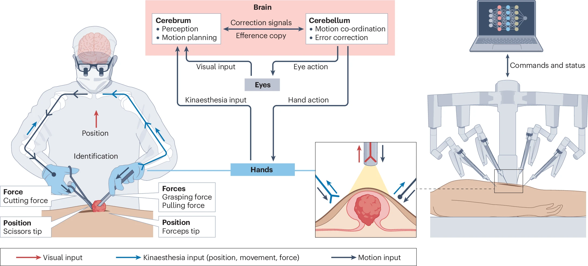

# Tangyou Liu (刘唐有)

**Postdoctoral Fellow** Department of Electronic Engineering, The Chinese University of Hong Kong (CUHK)  
📍 Room 431, SHB, CUHK, Shatin, HKSAR  
📧 Email: tangyouliu@cuhk.edu.hk

---

## 👨‍🎓 About Me

Hi, I'm Tangyou Liu 👋, currently a Postdoctoral Fellow at the **The Chinese University of Hong Kong (CUHK)**. My research focuses on **Medical/Surgical Robotics**, **Surgical Navigation**, and **Human-Robot Interaction**, with a particular interest in force sensing technologies for precise and autonomous surgical systems.
I received my Ph.D. from the **University of New South Wales (UNSW)** in 2025, under the supervision of Prof. Liao Wu. Before that, I obtained my M.E. degree from the **Harbin Institute of Technology, Shenzhen (HITsz)** in 2021, under the supervision of Prof. Max Q.-H. Meng.
My current work aims to enhance the safety and autonomy of robotic surgery through multimodal perception and artificial intelligence.

---

## 🔥 News
* **[2026.02]** Appointed as Junior Editorial Board Member of *Biomimetic Intelligence and Robotics* (JCR Q1)!
* **[2026.01]** Our paper on *"Artificial kinaesthesia in autonomous robotic surgery"* was published in **Nature Reviews Bioengineering** (IF: 37.6)!
* **[2025.08]** Joined CUHK as a Postdoctoral Fellow.
* **[2025.07]** Received the **Best Student Paper Award** at IEEE AIM Conference.

## 📝 Selected Publications
<table>
  <tr>
    <td width="30%">
      
    </td>
    <td width="70%">
      <h3>Artificial kinaesthesia in autonomous robotic surgery</h3>
      

        <strong>Liu, T.</strong>, Yuan, S. and Ren, H. 
        <em>Nature Reviews Bioengineering</em>, 2026. (Q1, IF: 37.6) 
        <a href="https://doi.org/10.1038/s44222-026-00403-z">[DOI]</a>
      

      

        <em>(Description: Proposed the concept of artificial kinaesthesia to enhance safety in autonomous robotic surgery...)</em>
      

    </td>
  </tr>
<table>

<table>
  <tr>
    <td width="30%">
      
    </td>
    <td width="70%">
      <h3>Robotic intracorporeal palpation with a miniature force-sensing probe for minimally invasive surgery.</h3>
      

        <strong>T. Liu</strong>, Zhang, X., Zhang, C., Wang, T., Song, S., Wang, J., and Wu, L. 
      <em> IEEE Transactions on Instrumentation and Measurement (T-IM)</em>, 2025. (Q1, IF: 5.9) 
        <a href="https://doi.org/10.1109/TIM.2025.3580873">[DOI]</a> 
        <a href="https://www.youtube.com/watch?v=8zV_8tDZgZU" target="_blank">[🎥 Video]</a>
      

    </td>
  </tr>
</table>

<table>
  <tr>
    <td width="30%">
      
    </td>
    <td width="70%">
      <h3>Automatic Tissue Traction Using Miniature Force-Sensing Forceps for Minimally Invasive Surgery</h3>
      

        <strong>T. Liu</strong>, X. Wang, J. Katupitiya, J. Wang, L. Wu. 
        <em>IEEE Transactions on Robotics (T-RO)</em>, 2024. (Q1, IF: 10.5) 
        <a href="https://doi.org/10.1109/TRO.2024.3486177">[DOI]</a> 
        <a href="https://www.youtube.com/watch?v=f5gXuXe67Ak" target="_blank">[🎥 Video]</a>
      

    </td>
  </tr>
</table>

<table>
  <tr>
    <td width="30%">
      
    </td>
    <td width="70%">
      <h3>Haptics-Enabled Forceps With Multi-Modal Force Sensing: Towards Task-Autonomous Surgery.</h3>
      

        <strong>T. Liu</strong>, Zhang, T., Katupitiya, J., Wang, J., and Wu, L. 
        <em>IEEE/ASME Transactions on Mechatronics (T-MECH)</em>, 2023. (Q1, IF: 7.3) 
        <a href="https://doi.org/10.1109/TMECH.2023.3329564">[DOI]</a>
        <a href="https://www.youtube.com/watch?v=pi9bqSkwCFQ" target="_blank">[🎥 Video]</a>
      

    </td>
  </tr>
</table>

<table>
  <tr>
    <td width="30%">
      
    </td>
    <td width="70%">
      <h3>A review on the Form and Complexity of Human-Robot Interaction in the Evolution of Autonomous Surgery</h3>
      

        <strong>T. Liu</strong>, Wang, J., Wong, S., Razjigaev, A., Beier, S., Peng, S., Do, T.N., Song, S., Chu, D., Wang, C.H., Lovell, N.H., and L. Wu. 
        <em>Advanced Intelligent Systems (AIS), 2024. (Q1, IF: 6.7) 
        <a href="https://doi.org/10.1002/aisy.202400197">[DOI]</a>
      

      

        <em>(Description:...)</em>
      

    </td>
  </tr>
<table>

<table>
  <tr>
    <td width="30%">
      
    </td>
    <td width="70%">
      <h3>Towards Terrain Adaptability: In Situ Transformation of Wheel-Biped Robots.</h3>
      

        <strong>T. Liu</strong>, Zhang, C., Wang, J., Song, S., and Meng, M.Q.H. 
        <em> IEEE Robotics and Automation Letters (RA-L)</em>, 2022. (Q1, IF: 5.3) 
        <a href="https://doi.org/10.1109/LRA.2022.3148486">[DOI]</a>
        <a href="https://www.youtube.com/watch?v=vTMGKF0DG6k" target="_blank">[🎥 Video]</a>
      

    </td>
  </tr>
</table>
---

## 🎖 Honors & Awards

* **2025**: Best Student Paper, IEEE AIM Conference
* **2023**: Best Poster Award, ICRA 2023 (London, UK)
* **2021-2025**: Tyree IHealthE Ph.D. Scholarship (Awarded to only 3 students at UNSW)
* **2021**: Champion of KUKA China R&D Innovation Challenge
* **2021**: Outstanding Graduate, Harbin Institute of Technology

---

## 🧩 Professional Activities

* **Junior Editor**: *Biomimetic Intelligence and Robotics* (JCR Q1)
* **Session Chair**: ICBIR 2025, ROBIO 2019
* **Reviewer**: IEEE T-RO, T-Mech, T-IM, RA-L, ICRA, IROS, Nature Communications, npj Digital Medicine

---

## 🛠 Skills

* **Programming**: C/C++, MATLAB, Python 
* **Robotics & Tools**: ROS, Gazebo, SolidWorks, Creo, KeyShot 
